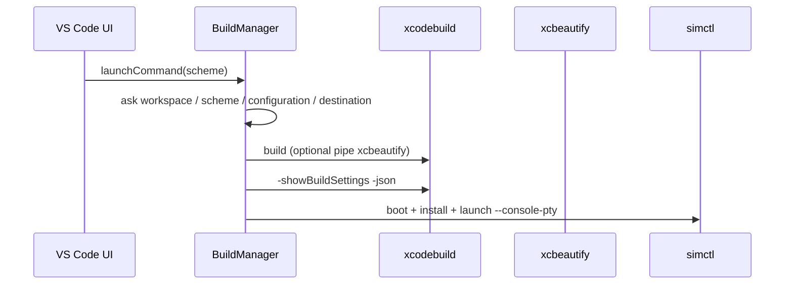

# SweetPad 技术参考与 Xcode Pilot 对照

参考仓库：[sweetpad-dev/sweetpad](https://github.com/sweetpad-dev/sweetpad)（VS Code / Cursor 的 iOS 开发扩展）。

## SweetPad 架构概览

| 模块 | 职责 |
|------|------|
| `src/build/` | Build / Launch / Clean、`XcodeCommandBuilder`、侧边栏 Scheme 树 |
| `src/run/` | 前台进程与日志解析（`MainExecutable`、sidecar） |
| `src/destination/` | 模拟器 / 真机 / Mac destination 聚合与缓存 |
| `src/common/cli/scripts.ts` | `xcodebuild`、`simctl`、`showBuildSettings`、scheme 列表 |
| `src/common/xcode/workspace` | 解析 `.xcworkspace` / `.xcodeproj`（比纯 `xcodebuild -list` 快） |
| `src/common/tasks/` | 终端任务 v2/v3、pty、`xcbeautify` 管道 |
| `package.json` | 自定义 task type `sweetpad`、problem matchers |

技术栈：**TypeScript + VS Code Extension API**，深度集成 UI（QuickPick、TreeView、TaskProvider）。

## 构建与运行流水线（核心）



### 1. 工程发现（与 CocoaPods / SPM）

- 递归查找 `.xcworkspace`、`Package.swift`（深度约 4 层）。
- 有 **Podfile** 时优先根目录 **`.xcworkspace`**（排除 `project.xcworkspace`），标注 “CocoaPods (recommended)”。
- **SPM 纯包**：`detectWorkspaceType === "spm"` 时走 `swift build` / `swift run`，cwd 为包目录。
- 多工程时 QuickPick；单工程可自动选择并写入 workspace 缓存。

对应 Xcode Pilot：`crates/core/src/detect.rs`（Podfile → workspace，排除 Pods）。

### 2. Scheme / Configuration

- 优先 **XcodeWorkspace 解析器**，失败再 **`xcodebuild -list -json`**。
- `parseCliJsonOutput`：从含警告的 stdout 中截取 `{...}` JSON（实用技巧）。

对应 Xcode Pilot：已用 `-list -json`，可后续移植 JSON 截取逻辑。

### 3. Destination

- `xcodebuild -showdestinations` + `DestinationsManager`（模拟器列表、真机、Mac）。
- `-showBuildSettings` 得到 `SUPPORTED_PLATFORMS`，过滤不支持的 destination。
- 缓存用户上次选择的 destination。

对应 Xcode Pilot：v0.1 仅解析 `-showdestinations` 取第一个 iOS Simulator；v0.2 可对齐 build settings 过滤。

### 4. 构建命令

`XcodeCommandBuilder` 组装：

- `-workspace` / `-project`、`-scheme`、`-configuration`、`-destination`
- `-derivedDataPath`（可配置，默认系统 DerivedData 或项目相对路径）
- `build` / `clean` action
- 可选 **ARCHS**、**GCC_GENERATE_DEBUGGING_SYMBOLS**（调试）
- 管道 **xcbeautify**（默认开启，若已安装）
- **`-allowProvisioningUpdates`**（真机签名）

对应 Xcode Pilot：`build_project` + 可选 `xcbeautify`、固定项目内 DerivedData。

### 5. 定位 .app（SweetPad 的关键差异）

**不**靠遍历 DerivedData 猜 .app，而是：

```text
xcodebuild -showBuildSettings -scheme ... -configuration ... -destination ... -json
```

从 JSON 读取 `TARGET_BUILD_DIR`、`WRAPPER_NAME` / `FULL_PRODUCT_NAME` → `appPath`，`PRODUCT_BUNDLE_IDENTIFIER` → bundle id。多 target 时解析 `.xcscheme` 的 `LaunchAction` 选对 target。

对应 Xcode Pilot：**已改为同款 showBuildSettings 路径**（见 `crates/core/src/build_settings.rs`）。

### 6. 模拟器运行

1. `simctl boot`（若未启动）
2. `open -a Simulator`（可配置是否置前）
3. `simctl install <udid> <app.app>`
4. `simctl launch --console-pty --terminate-running-process <udid> <bundleId>`（调试时加 `--wait-for-debugger`）
5. 并行 **SimulatorLogSidecar** 聚合日志

对应 Xcode Pilot：boot + install + `--console-pty` + `--terminate-running-process`。

### 7. 真机（SweetPad 有，Pilot v1 未做）

- iOS 17+：`xcrun devicectl device install app` + `process launch --console`
- 更老：`ios-deploy`
- 隧道 / pymobiledevice3 日志 sidecar

### 8. 与 Zed / LSP 联动（SweetPad 强项）

- 构建后可选生成 **buildServer.json**（xcode-build-server）
- Scheme 变更时自动 `refreshBuildServer`
- `swift.restartLSPServer`

Xcode Pilot v1 不实现；README 中引导用户自行配置 Swift 扩展 + xcode-build-server。

## VS Code vs Zed 能力差异

| 能力 | SweetPad | Xcode Pilot (Zed) |
|------|----------|-------------------|
| 侧边栏 Scheme 列表 | ✅ TreeView | ❌ 靠 CLI + tasks |
| QuickPick 选 destination | ✅ | ❌ 写死在 `.xcode-pilot.toml` |
| 自定义 TaskProvider | ✅ `type: sweetpad` | ⚠️ 仅静态 `.zed/tasks.json` |
| Problem matcher / 诊断 | ✅ DiagnosticsManager | ❌ 依赖终端输出点击 |
| 扩展内写 settings | ✅ | ❌ WASM 不能写工作区 |
| MCP / Agent | 部分 | 可 v0.2 加 context server |

**结论**：Zed 侧应坚持 **CLI 一等公民** + 生成 tasks；UI 选择器需等 Zed 动态 tasks 或 MCP。

## Xcode Pilot 从 SweetPad 已吸收 / 计划吸收

| 项 | 状态 |
|----|------|
| `-showBuildSettings -json` 取 app / bundleId | ✅ v0.1.1 |
| `simctl launch --console-pty --terminate-running-process` | ✅ |
| 构建前 `-resolvePackageDependencies` | ✅ 独立命令；build 可自动调用 |
| xcbeautify 管道 | ✅ 配置项 `xcbeautify` |
| Podfile → workspace | ✅ |
| JSON 从噪声输出中提取 | 📋 待办 |
| 真机 devicectl | 📋 v0.2 |
| xcode-build-server 自动生成 | 📋 文档引导 |
| XcodeWorkspace 快速解析 | 📋 可选 |

## 许可说明

SweetPad 为 MIT。Xcode Pilot 借鉴的是 **流程与命令行组合**，不复制其 TypeScript 实现；架构文档仅供团队对齐。
