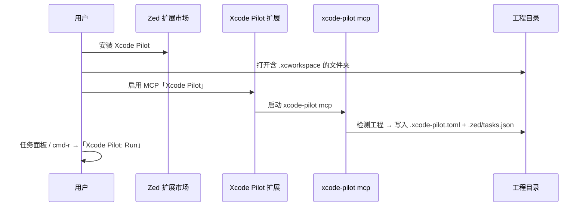

# 用户体验目标（产品定义）

## 你期望的路径

1. 用户在 Zed **扩展市场在线安装**「Xcode Pilot」
2. 打开 **Xcode 工程目录**（含 `.xcodeproj` / `.xcworkspace`，含 CocoaPods）
3. 扩展 **自动识别工程**，无需手写配置
4. 用户能 **编译 / 运行**（模拟器），体验接近 SweetPad 的 Build & Run

## 当前实现方式（v0.1）

Zed 扩展 **还不能**像 VS Code 一样内置侧边栏播放按钮，也不能在 WASM 里直接写工作区文件。因此采用 **SweetPad 同款的底层命令** + **自动生成本地任务**：

### 用户操作步骤（3 步）

1. **安装扩展**：Zed → Extensions → 搜索 `Xcode Pilot` → Install  
2. **打开工程**：File → Open Folder → 选择含 `Podfile` 或 `.xcodeproj` 的目录  
3. **启用 MCP（一次性）**：Settings → MCP → 启用扩展提供的 **Xcode Pilot**  
   - 首次连接会自动 `ensure`，生成运行任务  
4. **运行**：`task: spawn` →「Xcode Pilot: Run」，或绑定 `cmd-r`（见 README）

### 自动检测规则

| 信号 | 行为 |
|------|------|
| `Podfile` | 使用根目录 `.xcworkspace`（排除 `project.xcworkspace`） |
| 仅 `.xcodeproj` | 使用该项目 |
| `Package.swift` 且无 Xcode 工程 | 提示不支持（v1 仅 Xcode 工程） |

### 上架后仍需系统依赖

- macOS + Xcode（`xcodebuild`）
- 扩展通过 MCP 调用 **`xcode-pilot` 可执行文件**（`cargo install --path crates/cli`；后续版本由扩展自动下载 Release 二进制）

## 与 SweetPad 的差异

| SweetPad (VS Code) | Xcode Pilot (Zed) v0.1 |
|--------------------|-------------------------|
| 侧边栏 Scheme + ▶️ | 任务列表 + 快捷键 |
| 安装即用 TaskProvider | 安装扩展 + 启用 MCP → 自动生成 tasks |
| 选模拟器 QuickPick | 默认模拟器写入 `.xcode-pilot.toml`（可手改） |

## 路线图（贴近「安装即用」）

| 版本 | 目标 |
|------|------|
| v0.1 | 市场安装 + MCP 自动 `ensure` + Run/Build 任务 |
| v0.2 | 扩展内下载 `xcode-pilot` 二进制，**无需** `cargo install` |
| v0.3 | Zed 动态 tasks API → 打开文件夹即出现 Run，无需 MCP |
| v0.4 | 模拟器 / Scheme QuickPick（对齐 SweetPad） |
